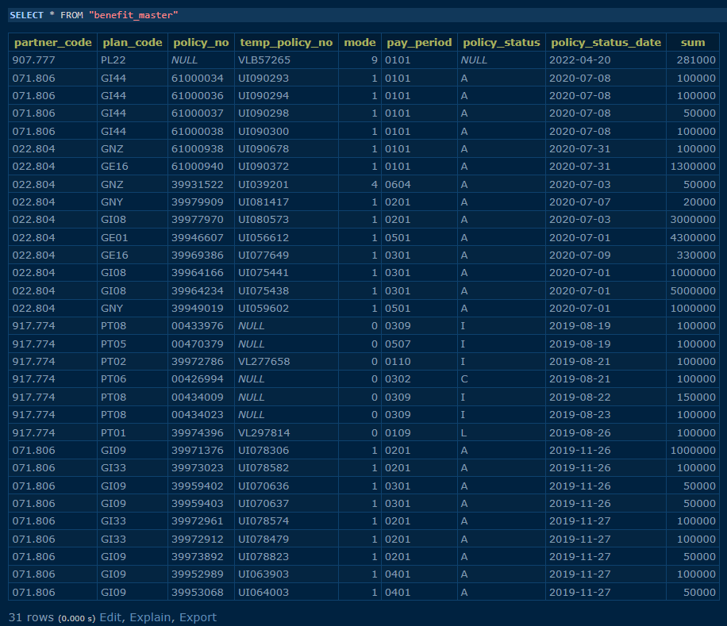
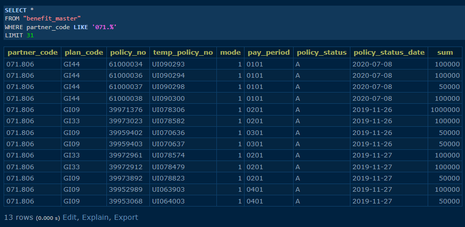
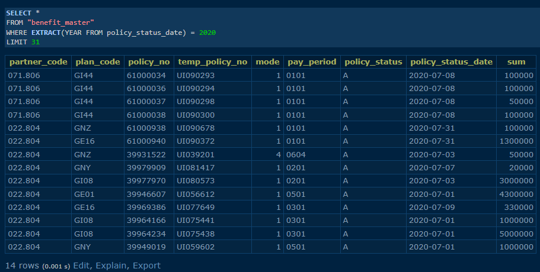
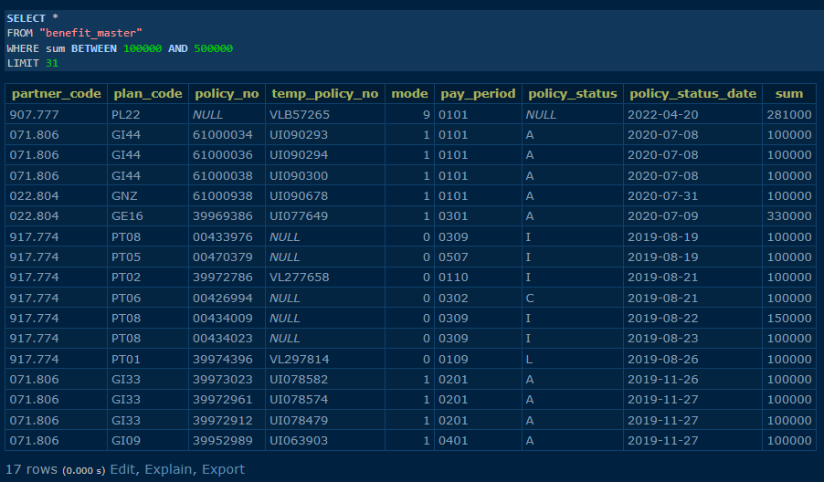

# SQL Dev

[Table Data 📅](#-table-data) •
[Result Answer 1️⃣](#result-answer-1️⃣) •
[Result Answer 2️⃣](#result-answer-2️⃣) •
[Result Answer 3️⃣](#result-answer-3️⃣)

## 📅 Table Data

## Result Answer 1️⃣

## Result Answer 2️⃣

## Result Answer 3️⃣

