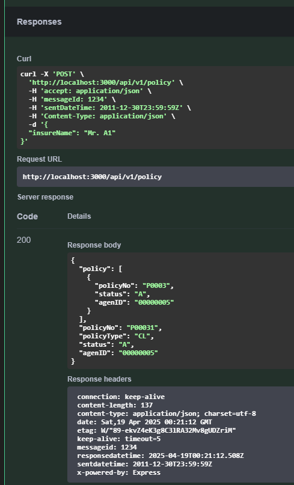
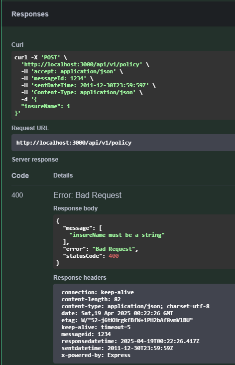
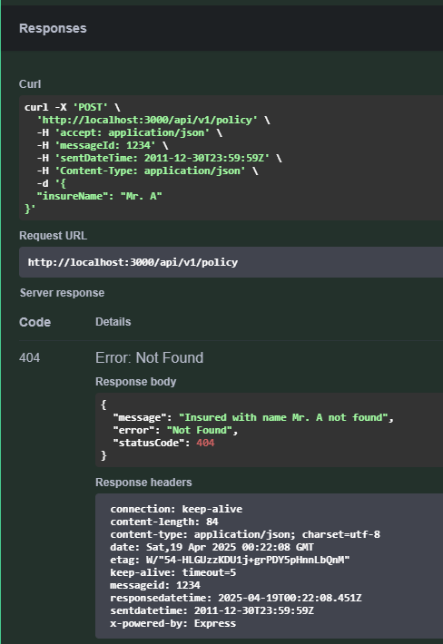

# 🚀 TLI Test Dev API

<div align="center">
  
  
  <p>
    <strong>A robust RESTful API service built with NestJS framework</strong>
  </p>
  
  <p>
    <a href="#-technology-stack">Technology</a> •
    <a href="#-installation">Installation</a> •
    <a href="#%EF%B8%8F-running-the-app">Running</a> •
    <a href="#-api-documentation">Documentation</a> •
    <a href="#-features">Features</a> •
    <a href="#-api-examples">Examples</a>
  </p>
</div>

---

## ✨ Features

- **RESTful API** endpoints with prefixed routes (`/api/v1`)
- **Swagger Documentation** with interactive UI
- **JSON Database** simulation for development
- **Validation** of request data and headers

## 🔧 Technology Stack

| Technology                                                      | Purpose                          |
| --------------------------------------------------------------- | -------------------------------- |
| [NestJS](https://nestjs.com/)                                   | Progressive Node.js framework    |
| [TypeScript](https://www.typescriptlang.org/)                   | JavaScript with syntax for types |
| [Swagger](https://swagger.io/)                                  | API documentation                |
| [class-validator](https://github.com/typestack/class-validator) | Validation library               |

## 💻 Installation

```bash
# Install dependencies
$ npm install

# Create environment file from example
$ cp .env.example .env
```

## 🔧 Environment Configuration

This project requires a `.env` file for environment variables. Create this file by copying the provided example:

```bash
# Copy and customize for your environment
$ cp .env.example .env
```

The `.env.example` file contains:

```
PORT=3000
```

Adjust these values as needed for your development environment.

## ▶️ Running the App

```bash
# Development mode
$ npm run start:dev

# Production mode
$ npm run start:prod
```

## 📁 Project Structure

```
src/
├── common/           # Common utilities, interceptors, decorators
├── database/         # Database data mockup using JSON files
├── policy/           # Policy module with controllers, services
│   ├── dto/          # Data Transfer Objects
│   └── interfaces/   # TypeScript interfaces
├── app.module.ts     # Main application module
└── main.ts           # Application entry point
```

## 💾 Database Simulation

This project uses JSON files to simulate a database for development and testing purposes. The database mockup files are stored in the `src/database/` directory.

## 🔍 Validation Layer

### Input Validation

<details>
  <summary><strong>DTO Validation with class-validator</strong></summary>
  <p>
  The project implements robust input validation using class-validator. Each API endpoint validates incoming data against predefined DTO (Data Transfer Object) schemas to ensure:
  
  - Required fields are present
  - Data types match expected formats
  - Values fall within acceptable ranges
  - Custom validation rules are enforced
  </p>
</details>

### Request Headers Validation

<details>
  <summary><strong>Custom Headers Decorator</strong></summary>
  <p>
  The application uses a custom decorator (<code>headers.decorator.ts</code>) in the <code>common/decorators</code> to validate incoming request headers. This decorator:
  
  - Checks that all required headers are present
  - Validates header data types and formats
  - Rejects requests with missing or invalid headers
  </p>
</details>

## 🔄 Interceptors

<details>
  <summary><strong>Headers Management</strong></summary>
  <p>
  The application uses NestJS Interceptors to manage response headers. The <code>HeadersInterceptor</code> in the <code>common/interceptors</code> directory handles important response headers:
  
  - <code>messageId</code>: Unique identifier for each response
  - <code>sentDateTime</code>: Time sent from the source system
  - <code>responseDateTime</code>: When the response was sent
  
  This ensures consistent tracking and monitoring of API communications.
  </p>
</details>

## 📚 API Documentation

After starting the application, you can access the Swagger documentation at:

```
http://localhost:3000/
```

The API endpoints are available at:

```
http://localhost:3000/api/v1
```

## 🖼️ API Examples

Below are some example screenshots of the API in action:

### 200 OK Request Example



### 400 Bad Request Example



### 404 Not Found Example


